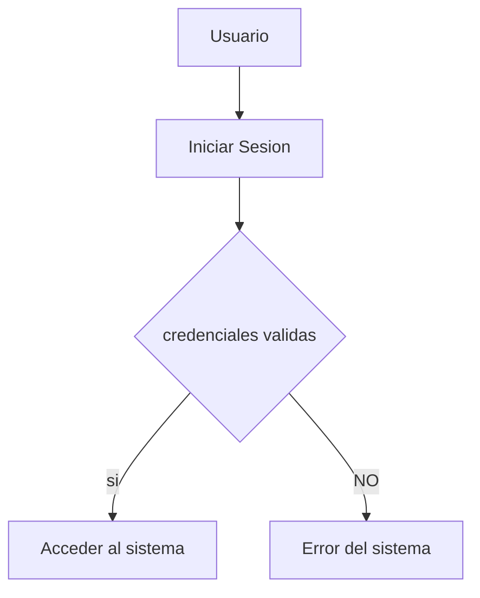
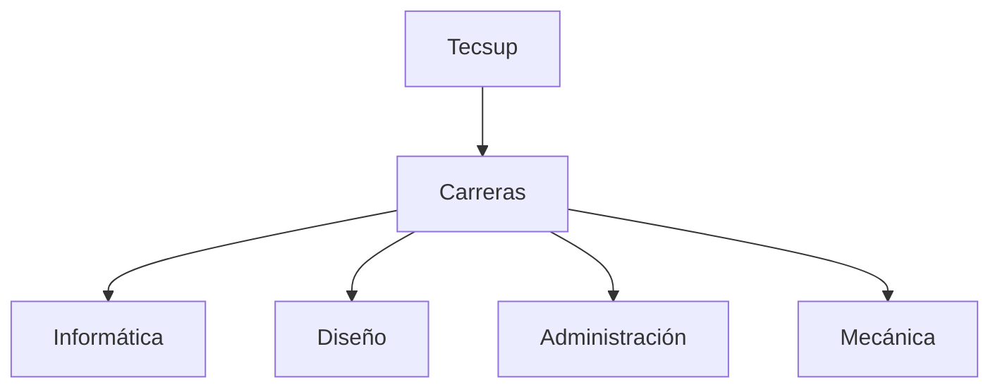

# Titulo Importante
Me encuentro aprendiendo *Markdown* en las clases del profesor
Luis Pallin..
## Subtitulo 01
Aqui verificamos como formatear diferentes **tipos de texto**.
## Subtitulo 02
Podremos comocer diferentes tipo de formatos de textos
usando ~~Markdown~~.

### Creando Hiperv....
[Google](https://www.google.com)
[Tecsup](https://www.tecsup.edu.pe)

## Colocar Imágenes


## Funciones
- [X] Registrar Alumno
- [X] Generar Matricula
- [ ] Campo Vacio
- [ ] Libre

## Creando Tablas
| Lenguaje de Programación | Creador |
| ------------------------ | --------|
| Java |James Cosling |
| PHP  |Rasmus Lerdor |
| Python  | Guido Van Rossum |

## Codigo
```html
<h1>Hola Mundo</h1>
```

```css
body{
    background:"red";
}
```
```java
public class Main {
    public static void main(String[] args) {
        System.out.println("Hola Mundo Java");
    }
}
```



